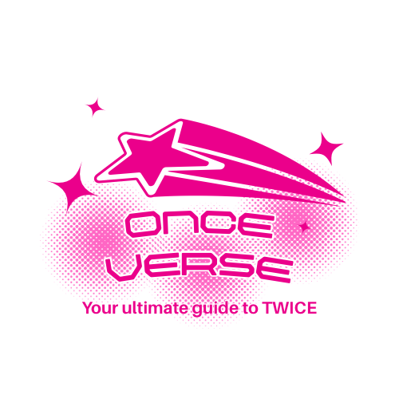
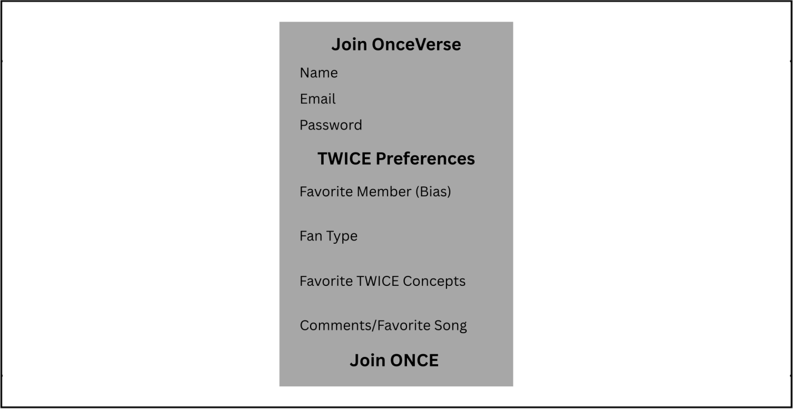
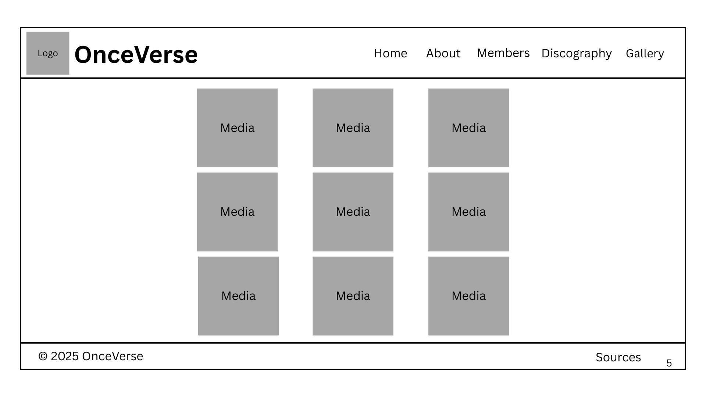

# FINAL MODIFICATION PROPOSAL

# 💫 OnceVerse
### "Your ultimate guide to TWICE"



---

## 🌐 Website Description

**OnceVerse** is an interactive fan guide dedicated to the world of **TWICE**, the global K-pop sensation.  
The website is designed to be a one-stop destination for ONCEs (TWICE fans) — featuring detailed profiles, discographies, music video galleries, and exclusive trivia about each member.  

Whether you’re a long-time fan or just discovering TWICE, OnceVerse celebrates their journey through music, visuals, and unforgettable moments that made them one of the most iconic girl groups of the generation.

---

## 🧭 Website Outline (5 Pages)

| Page | Description |
|------|--------------|
| **Home** | Welcomes visitors with a TWICE banner, along with special homepage navigation buttons that provide quick access to key sections like About, Members, Discography, and Gallery. |
| **About** | Explains the group’s formation, milestones, and achievements from 2015 to present. |
| **Members** | Displays profiles of all nine members — photos, birthdays, positions, and fun facts. |
| **Discography** | Lists albums, title tracks, and release years with album cover previews. |
| **Gallery** | Contains photos, music videos, and highlight clips from concerts or performances. |

---

# TWICE Website Wireframes

## Sign-up Page


## Home Page


## About Page


## Members Page


## Discography Page


## Gallery Page


---

# 3rd Q Update

## Final Title
OnceVerse: Interactive TWICE Website

## 2-Sentence Description
OnceVerse is an interactive fan website dedicated to TWICE that provides organized information about the group, its members, and their discography. The website enhances user experience by allowing fans to personalize content through HTML forms and dynamic JavaScript features.

## Features
- Fan Membership sign-up form that collects and saves user preferences  
- Personalized fan dashboard that displays user-specific information  
- Interactive discography page with dynamic album previews and recommendations  

## Details
The website is built using HTML for structure, CSS for layout and design, and JavaScript for interactivity. User data collected through the fan membership form is stored locally using JavaScript `localStorage` and reused across multiple pages to create a personalized browsing experience without relying on a backend database.

## How the Forms Are Incorporated
HTML forms are incorporated through a dedicated **Fan Membership Sign-Up page**, which serves as the main point of user interaction. The form gathers information such as username, email address, and TWICE preferences using text inputs, dropdown menus, radio buttons, and checkboxes.

Upon submission, JavaScript processes and stores the input using `localStorage`. The stored data is then retrieved on other webpages like the **Fan Dashboard** and **Discography** pages to display personalized greetings and recommend albums based on user preferences.

## Definition of Done
- The website includes at least six (6) fully functional pages  
- The HTML form correctly collects and stores user input  
- Stored data is successfully retrieved and used on at least two (2) webpages  
- Interactive features function as intended without page reloads

## 1. This Project is for our classmates

## 2. Reason 
They will love this project because it offers a well-organized and accessible way to explore everything about the group, from member profiles to their discography, making it especially helpful for new fans who want to learn more without feeling overwhelmed. In addition, the interactive and personalized features, such as the sign-up form, fan dashboard, and dynamic album previews, create a more engaging experience where users can actively interact with the content instead of just viewing it. At the same time, longtime ONCEs will appreciate how the website highlights TWICE’s milestones, achievements, and musical journey, allowing them to relive memorable moments and deepen their connection to the group.

## 3. This Project Includes:
 - Log-in / Sign-up Page

## 4. This Project does not include:
 - CRUD

## 5. Website License Agreement
Permission is granted to view, use, and share this website for educational and non-commercial purposes only.

You may not copy, modify, distribute, or use any part of this website for commercial gain without prior written consent.

This website is provided "as is", without warranties of any kind. The creator is not responsible for any damages arising from its use.

#### Submitted by Keila Alejandro & Yuuna Jarme 
#### on March 18, 2026 
#### to Sir Roy
#### in partial fulfillment of the requirements of CS3 of DOST-PSHS-MC 

___

## ⚙️ JavaScript Integration

JavaScript will be used on the **Discography** page for interactive album previews.

When users hover or click on an album cover, it will:
- Display the album name, release date, and tracklist dynamically.
- Allow users to switch between albums without reloading the page.

**Example Script:**
```js
const albums = {
  'READY TO BE': ['SET ME FREE', 'MOONLIGHT SUNRISE', 'BLAME IT ON ME'],
  'BETWEEN 1&2': ['Talk that Talk', 'Queen of Hearts', 'Basics']
};

function showAlbum(name) {
  const trackList = albums[name];
  let output = `<h3>${name}</h3><ul>`;
  trackList.forEach(track => {
    output += `<li>${track}</li>`;
  });
  output += '</ul>';
  document.getElementById('albumInfo').innerHTML = output;
}

